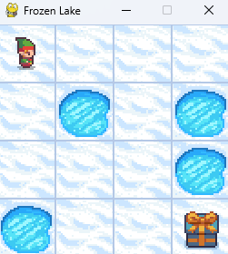
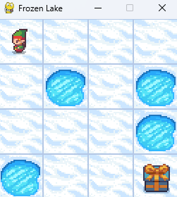

# Reinforcement Learning with FrozenLake

This project aims to explore the basic concepts of Reinforcement Learning using the `FrozenLake` environment from the OpenAI Gym library. View training history at https://wandb.ai/liu-chang/FrozenLake.

## Concepts covered:

- Introduction to reinforcement learning: agents, environments, actions, rewards.
- Policies and value functions.
- Bellman's equation.

---

## GIF Comparison

<p align="center">
    See each agent in action (all trained for 10,000 episodes):
</p>

<p align="center">
  <table align="center">
    <tr>
      <td align="center">
        <b>Random Agent</b><br>
        <br>
      </td>
      <td align="center">
        <b>Random with Bellman</b><br>
        <br>
      </td>
    </tr>
    <tr>
      <td align="center">
        <b>Q-Learning Agent</b><br>
        <br>
      </td>
      <td align="center">
        <b>SARSA Agent</b><br>
        <br>
      </td>
    </tr>
  </table>
</p>

<p align="center">
    <b>*The best performance after 10,000 episodes was from Q-Learning Agent</b>
</p>

---

## Instructions:

### Environment Setup:

It's recommended to create a virtual environment to install the necessary dependencies and maintain the project's consistency:

```bash
python -m venv frozen_lake
source frozen_lake/bin/activate  # On Windows use: frozen_lake\Scripts\activate
```

After activating the virtual environment, install the dependencies through the `requirements.txt` file:

```bash
pip install -r requirements.txt
```

### Setup on Codespaces

Alternatively, the following commands can be used to set up the environment on Codespaces

```
(games38) @drchangliu ➜ /workspaces/reinforcement-learning-frozen-lake (main) $ history
    1  which conda
    2  which python
    3  conda create -n games38 python=3.8
    4  ls
    6  conda init
    7  source ~/.bashrc
    8  conda activate games38
   13  conda install pillow  -c conda-forge
   14  conda install wandb
   15  conda install gymnasium
   17  conda install tqdm
   19  conda install pygame
   20  python sarsa_agent.py 
```

### Execution:

There are four main scripts to run:
- `random_agent.py`: Initial random agent implementation.
- `random_agent_bellman_function.py`: Random agent implementation with Bellman's function.
- `qlearning_agent.py`: Agent implemented using the Q-Learning algorithm.
- `sarsa_agent.py`: Agent implemented using the SARSA algorithm.

To run any of these scripts, use:

```bash
python <script_name>.py
```

In addition, the project also contains an auxiliary script test_pygame.py that can be used to validate the installation of pygame:

```bash
python test_pygame.py
```

---

## Implemented Algorithms:

### Q-Learning:

A reinforcement learning technique where the agent learns to act in a way that maximizes the expected reward over time.

### SARSA (State-Action-Reward-State-Action):

An on-policy control technique where the agent learns to evaluate actions in the environment based on actual rewards received.

---

## Environment:

### FrozenLake (Stochastic):

The agent must navigate a frozen lake and reach the goal without falling into holes. In stochastic mode, there's a chance the agent might slip even when given a clear movement instruction.

---

## Credits:

This project was developed with the help of the OpenAI platform and based on tutorials and documentation from the OpenAI Gym library.
